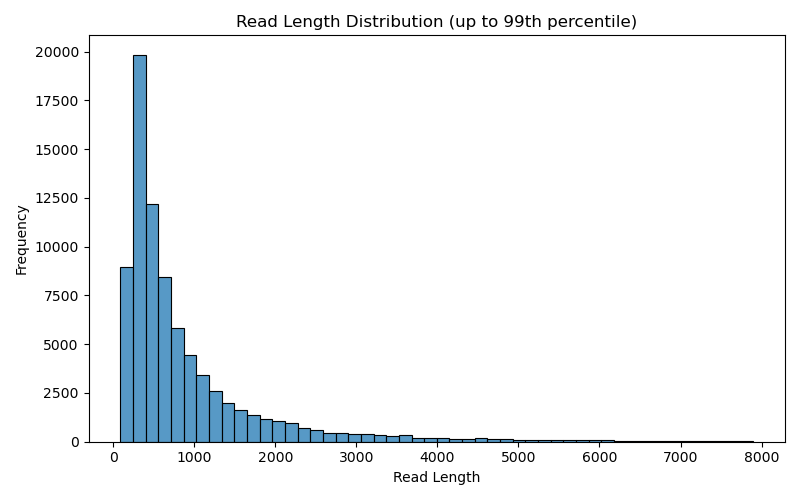
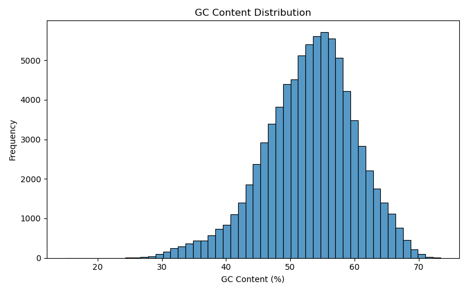
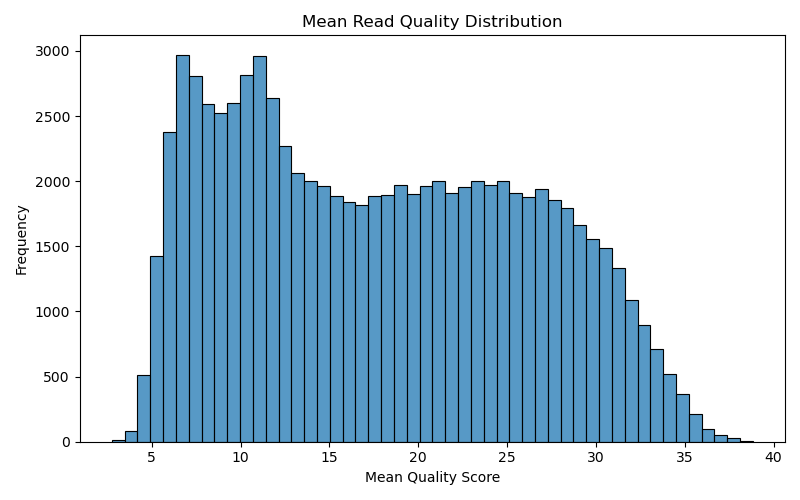

# Mini Bioinformatics QC Pipeline

## Project Overview

This project implements a small bioinformatics pipeline designed to perform quality control (QC) analysis on long-read sequencing data.

The pipeline processes a FASTQ file, calculates basic read statistics, generates visualizations of key metrics, and produces a simple summary report. The workflow is implemented using "Python" and "Snakemake" to ensure reproducibility.

The goal is to provide an accessible summary of sequencing data quality before proceeding to downstream analysis such as alignment.

## Pipeline Overview

The workflow performs the following steps:

1. Input
   - Raw sequencing data in FASTQ format

2. Read Statistics Calculation
   - Read length
   - GC content
   - Mean read quality score

3. Data Visualization
   - Distribution of read lengths
   - GC content distribution
   - Mean read quality distribution

4. Summary Statistics
   - Mean
   - Median
   - Basic descriptive statistics

The pipeline is orchestrated using "Snakemake"and runs within a "Conda" environment to ensure reproducibility.

## Methods

### Read Statistics

A custom Python script parses the FASTQ file using "Biopython" and computes the following metrics for each read:

- Read length
- GC content percentage
- Mean Phred quality score

The results are stored in a structured CSV file.

### Visualization

The computed statistics are visualized using:

- Matplotlib
- Seaborn

Histograms are generated for:

- Read length distribution
- GC content distribution
- Mean read quality distribution

NOTE: NanoPlot was considered as a long-read specific QC tool. 
However, installation failed on the local Windows environment due to dependency issues related to the pysam library. 
Therefore, the final pipeline relies on custom QC metrics implemented in Python.

## Results and Interpretation

### Read Length Distribution

The read length distribution shows a large number of shorter reads with a long tail extending toward longer sequences. This pattern is typical for long-read sequencing datasets.

### GC Content Distribution

The GC content distribution follows an approximately normal distribution centered around ~55%, suggesting no significant GC bias in the sequencing data.

### Mean Read Quality

Mean read quality scores are primarily between 10 and 30, which is within the expected range for long-read sequencing technologies.

### Overall Assessment

The dataset appears suitable for downstream analysis such as sequence alignment, with no major quality issues observed in the distributions.

## Validation

To verify the correctness of the generated metrics and visualizations, the dataset was also inspected using the "Galaxy platform". The distributions produced by the custom Python pipeline were consistent with the QC summaries observed in Galaxy.

## How to Run the Pipeline

### 1. Create the Conda Environment

conda env create -f environment.yml

### 2. Activate the Environment

conda activate bioinfo_case

### 3. Run the Pipeline

snakemake --cores 1

## Output Files

The pipeline generates the following outputs:
results/
read_stats.csv
read_length_distribution.png
gc_content_distribution.png
quality_distribution.png
summary_statistics.txt

Author

Pipeline developed as part of a bioinformatics internship case study.
